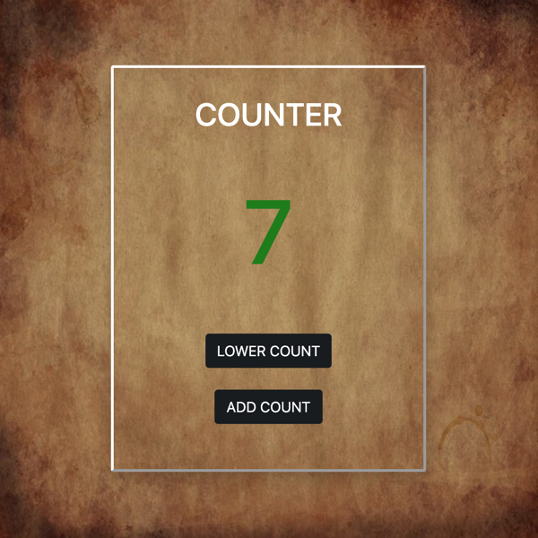

# counter-task
**Sidehustle.ng Week 3 Task: Implement a Counter App ith Javascript**

This is a task in the Frontend internship with <https://sidehustle.ng/>.

## **Task**
Create a counter that decrements a number when a button is clicked and increments it when a another button sis clicked.
The interface should look like this:

Given link to the image above: <https://jsbeginners.com/wp-content/uploads/2019/05/counter-javascript-project.png>

 

## **MY SOLUTION**
- [Live site](https://counter-task-lateefat.netlify.app/)
- [Github repo solution](https://github.com/Lateefat/counter-task) 

### Screenshot:

### MY PROCESS

## Built with
- Semantic HTML5 markup
- Bootstrap 5
- CSS custom properties
- Javascript

This was an easier task for me because I am more comfortable writing codes with logic. I get to implement a task the way I like.
It was also easier because we were taught how to use Bootstrap during the week. 
I will definitely be doing more Javascript projects.

